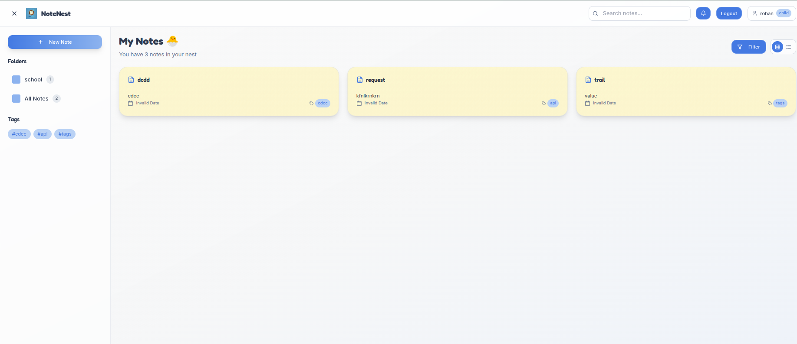
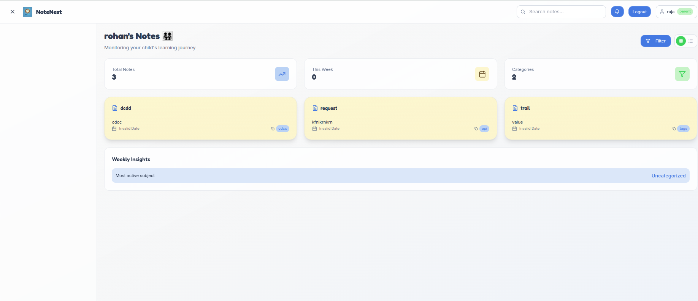
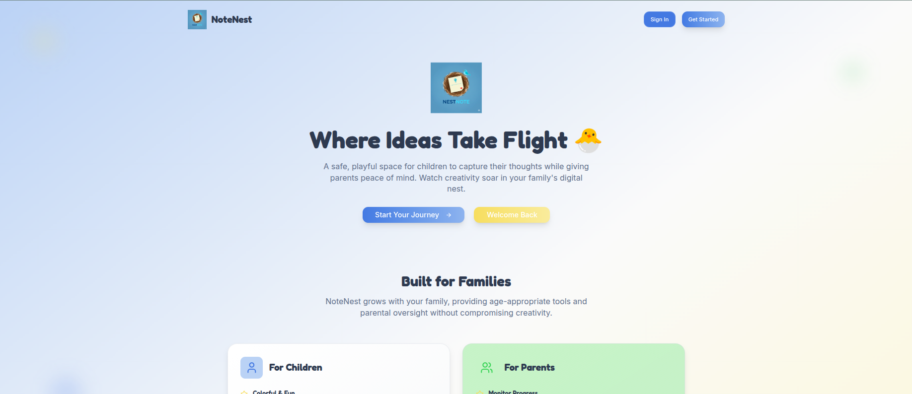

# NoteNest 🐣

A playful, family-friendly note-taking app for children and parents.  
**Empower creativity, foster learning, and keep parents in the loop—all in a safe digital nest.**

---

## ✨ Features

- **Role-based Access:**  
  - **Children:** Create, edit, and organize notes into folders and categories.
  - **Parents:** View their child's notes and progress in a secure, read-only dashboard.

- **To-Do & Checklist Notes:**  
  - Support for checkbox-style notes, perfect for to-do lists and learning tasks.

- **Tags & Organization:**  
  - Add tags and folders to notes for easy categorization and search.

- **Weekly Insights:**  
  - Parents get a snapshot of their child's most active subjects and creative progress.

- **Modern UI:**  
  - Built with React, Tailwind CSS, and shadcn-ui for a delightful, accessible experience.

- **Secure & Private:**  
  - No public notes. All data is private to your family.

---

## 📸 Screenshots

### Child Dashboard


### Parent Dashboard


### Note Creation UI


---

## 🚀 Quick Start

### Backend

```sh
cd backend
python3 -m venv .venv
source .venv/bin/activate
pip install -r requirements.txt
uvicorn main:app --reload
```

### Frontend

```sh
cd frontend
npm install
npm run dev
```

Visit [http://localhost:8080](http://localhost:8080) to use the app!

---

## 🏗️ Project Structure

```
note-nest-family-notes/
│
├── backend/
│   ├── main.py         # FastAPI app, API routes
│   ├── model.py        # SQLAlchemy models (Child, Parent, Note, ChecklistItem)
│   ├── sceheme.py      # Pydantic schemas
│   ├── service/        # Auth and note logic
│   └── ...             # DB, middleware, etc.
│
├── frontend/
│   ├── src/
│   │   ├── pages/      # Main pages (SignIn, SignUp, Dashboards)
│   │   ├── components/ # UI components (NoteCard, DashboardLayout, etc.)
│   │   └── lib/        # Utilities (auth, helpers)
│   └── ...             # Config, assets, styles
│
├── specification.txt   # Project requirements
└── README.md           # This file
```

---

## 🛡️ Authentication & Roles

- **Children:**  
  - Sign up and get a unique family code.
  - Can create, edit, and organize their own notes.

- **Parents:**  
  - Sign up using their child's family code.
  - Can view (but not edit) their child's notes and progress.

- **No JWTs or refresh tokens:**  
  - Simple, secure session management using email and password.

---

## 🗃️ Database Schema

- **Child:**  
  - `id`, `name`, `email`, `hashed_password`, `family_code`
- **Parent:**  
  - `id`, `name`, `email`, `hashed_password`, `child_id`
- **Note:**  
  - `id`, `title`, `content`, `owner_id` (child), `folder`, `tags`, `is_checklist`
- **ChecklistItem:**  
  - `id`, `note_id`, `text`, `checked`

---

## 🧑‍💻 Contributing

1. Fork this repo
2. Create your feature branch (`git checkout -b feature/my-feature`)
3. Commit your changes (`git commit -am 'Add new feature'`)
4. Push to the branch (`git push origin feature/my-feature`)
5. Open a Pull Request

---

## 📄 License

MIT License

---

## 💬 Contact

Questions, suggestions, or feedback?  
Open an issue or start a discussion on [GitHub](https://github.com/yourusername/note-nest-family-notes).

---

**Let your family's ideas take flight with NoteNest!**
